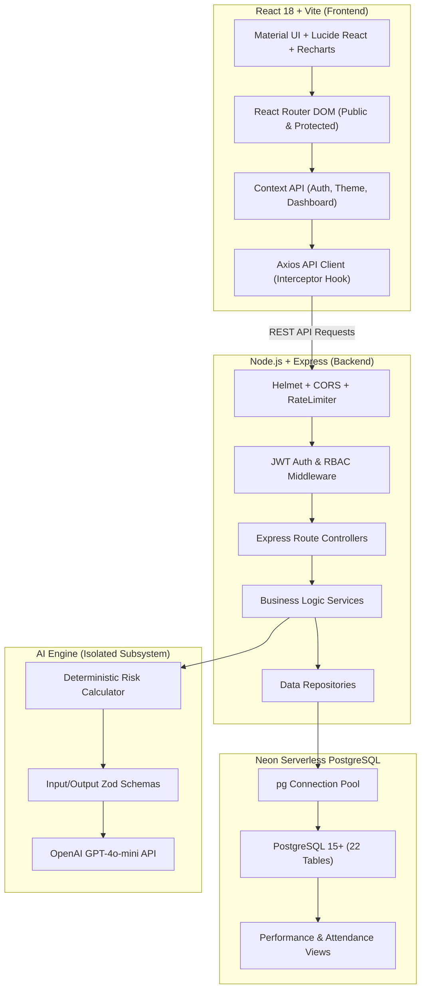

# EduInsight AI - System Architecture

```mermaid
flowchart TD
    subgraph Client["React 18 + Vite (Frontend)"]
        UI["Material UI + Lucide React + Recharts"]
        Routes["React Router DOM (Public & Protected)"]
        Context["Context API (Auth, Theme, Dashboard)"]
        API_Client["Axios API Client (Interceptor Hook)"]
    end

    subgraph Server["Node.js + Express (Backend)"]
        Security["Helmet + CORS + RateLimiter"]
        AuthMiddleware["JWT Auth & RBAC Middleware"]
        Controllers["Express Route Controllers"]
        Services["Business Logic Services"]
        Repos["Data Repositories"]
    end

    subgraph Database["Neon Serverless PostgreSQL"]
        PG["PostgreSQL 15+ (22 Tables)"]
        Pool["pg Connection Pool"]
        Views["Performance & Attendance Views"]
    end

    subgraph AI["AI Engine (Isolated Subsystem)"]
        OpenAI["OpenAI GPT-4o-mini API"]
        RuleEngine["Deterministic Risk Calculator"]
        Validator["Input/Output Zod Schemas"]
    end

    UI --> Routes
    Routes --> Context
    Context --> API_Client
    API_Client -->|REST API Requests| Security
    Security --> AuthMiddleware
    AuthMiddleware --> Controllers
    Controllers --> Services
    Services --> Repos
    Repos --> Pool
    Pool --> PG
    PG --> Views
    Services --> RuleEngine
    RuleEngine --> Validator
    Validator --> OpenAI
```
