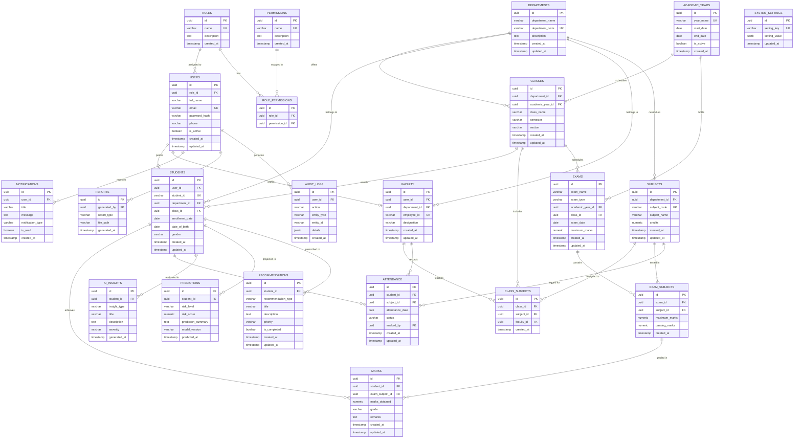

# EduInsight AI - Complete Database ER Diagram (22 Tables)

```mermaid
erDiagram
    ROLES ||--o{ USERS : "assigned to"
    ROLES ||--o{ ROLE_PERMISSIONS : "has"
    PERMISSIONS ||--o{ ROLE_PERMISSIONS : "mapped in"
    USERS ||--o| STUDENTS : "profile"
    USERS ||--o| FACULTY : "profile"
    USERS ||--o{ NOTIFICATIONS : "receives"
    USERS ||--o{ REPORTS : "generates"
    USERS ||--o{ AUDIT_LOGS : "performs"

    DEPARTMENTS ||--o{ CLASSES : "offers"
    DEPARTMENTS ||--o{ STUDENTS : "belongs to"
    DEPARTMENTS ||--o{ FACULTY : "belongs to"
    DEPARTMENTS ||--o{ SUBJECTS : "curriculum"

    ACADEMIC_YEARS ||--o{ CLASSES : "schedules"
    ACADEMIC_YEARS ||--o{ EXAMS : "holds"

    CLASSES ||--o{ STUDENTS : "enrolls"
    CLASSES ||--o{ CLASS_SUBJECTS : "includes"
    CLASSES ||--o{ EXAMS : "schedules"

    SUBJECTS ||--o{ CLASS_SUBJECTS : "assigned to"
    FACULTY ||--o{ CLASS_SUBJECTS : "teaches"
    SUBJECTS ||--o{ EXAM_SUBJECTS : "tested in"
    SUBJECTS ||--o{ ATTENDANCE : "logged for"

    EXAMS ||--o{ EXAM_SUBJECTS : "contains"
    EXAM_SUBJECTS ||--o{ MARKS : "graded in"
    STUDENTS ||--o{ MARKS : "achieves"
    STUDENTS ||--o{ ATTENDANCE : "participates"
    FACULTY ||--o{ ATTENDANCE : "records"

    STUDENTS ||--o{ AI_INSIGHTS : "evaluated in"
    STUDENTS ||--o{ PREDICTIONS : "projected in"
    STUDENTS ||--o{ RECOMMENDATIONS : "prescribed to"

    ROLES {
        uuid id PK
        varchar name UK
        text description
        timestamp created_at
    }

    PERMISSIONS {
        uuid id PK
        varchar name UK
        text description
        timestamp created_at
    }

    ROLE_PERMISSIONS {
        uuid id PK
        uuid role_id FK
        uuid permission_id FK
    }

    USERS {
        uuid id PK
        uuid role_id FK
        varchar full_name
        varchar email UK
        varchar password_hash
        varchar phone
        boolean is_active
        timestamp created_at
        timestamp updated_at
    }

    DEPARTMENTS {
        uuid id PK
        varchar department_name
        varchar department_code UK
        text description
        timestamp created_at
        timestamp updated_at
    }

    ACADEMIC_YEARS {
        uuid id PK
        varchar year_name UK
        date start_date
        date end_date
        boolean is_active
        timestamp created_at
    }

    CLASSES {
        uuid id PK
        uuid department_id FK
        uuid academic_year_id FK
        varchar class_name
        varchar semester
        varchar section
        timestamp created_at
        timestamp updated_at
    }

    STUDENTS {
        uuid id PK
        uuid user_id FK
        varchar student_id UK
        uuid department_id FK
        uuid class_id FK
        date enrollment_date
        date date_of_birth
        varchar gender
        timestamp created_at
        timestamp updated_at
    }

    FACULTY {
        uuid id PK
        uuid user_id FK
        uuid department_id FK
        varchar employee_id UK
        varchar designation
        timestamp created_at
        timestamp updated_at
    }

    SUBJECTS {
        uuid id PK
        uuid department_id FK
        varchar subject_code UK
        varchar subject_name
        numeric credits
        timestamp created_at
        timestamp updated_at
    }

    CLASS_SUBJECTS {
        uuid id PK
        uuid class_id FK
        uuid subject_id FK
        uuid faculty_id FK
        timestamp created_at
    }

    EXAMS {
        uuid id PK
        varchar exam_name
        varchar exam_type
        uuid academic_year_id FK
        uuid class_id FK
        date exam_date
        numeric maximum_marks
        timestamp created_at
        timestamp updated_at
    }

    EXAM_SUBJECTS {
        uuid id PK
        uuid exam_id FK
        uuid subject_id FK
        numeric maximum_marks
        numeric passing_marks
        timestamp created_at
    }

    MARKS {
        uuid id PK
        uuid student_id FK
        uuid exam_subject_id FK
        numeric marks_obtained
        varchar grade
        text remarks
        timestamp created_at
        timestamp updated_at
    }

    ATTENDANCE {
        uuid id PK
        uuid student_id FK
        uuid subject_id FK
        date attendance_date
        varchar status
        uuid marked_by FK
        timestamp created_at
        timestamp updated_at
    }

    AI_INSIGHTS {
        uuid id PK
        uuid student_id FK
        varchar insight_type
        varchar title
        text description
        varchar severity
        timestamp generated_at
    }

    PREDICTIONS {
        uuid id PK
        uuid student_id FK
        varchar risk_level
        numeric risk_score
        text prediction_summary
        varchar model_version
        timestamp predicted_at
    }

    RECOMMENDATIONS {
        uuid id PK
        uuid student_id FK
        varchar recommendation_type
        varchar title
        text description
        varchar priority
        boolean is_completed
        timestamp created_at
        timestamp updated_at
    }

    NOTIFICATIONS {
        uuid id PK
        uuid user_id FK
        varchar title
        text message
        varchar notification_type
        boolean is_read
        timestamp created_at
    }

    REPORTS {
        uuid id PK
        uuid generated_by FK
        varchar report_type
        varchar file_path
        timestamp generated_at
    }

    AUDIT_LOGS {
        uuid id PK
        uuid user_id FK
        varchar action
        varchar entity_type
        varchar entity_id
        jsonb details
        timestamp created_at
    }

    SYSTEM_SETTINGS {
        uuid id PK
        varchar setting_key UK
        jsonb setting_value
        timestamp updated_at
    }
```
