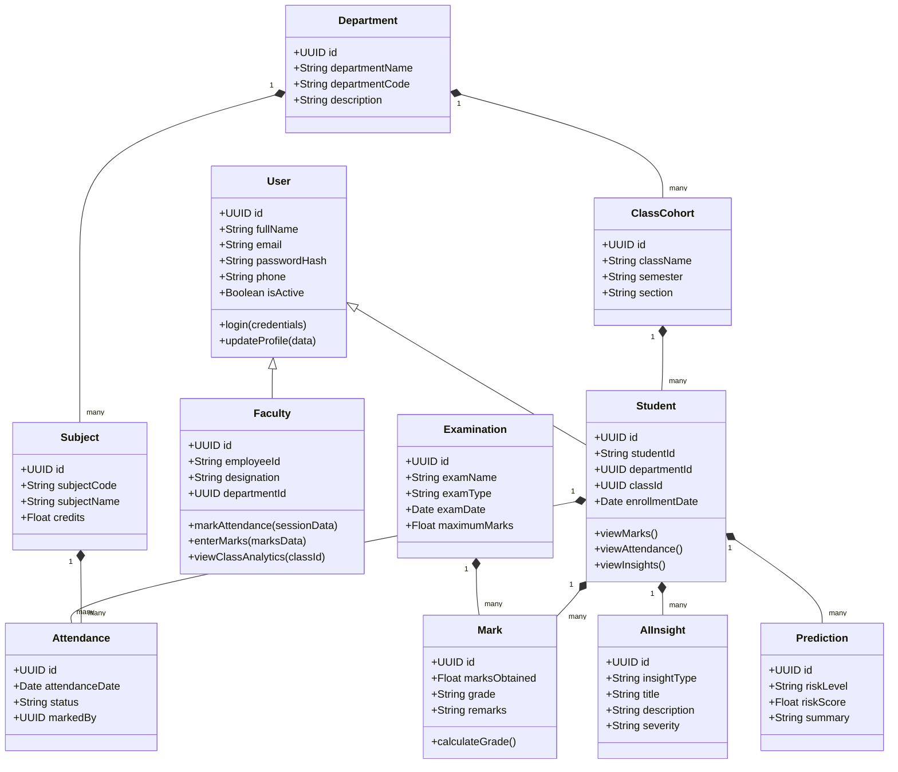

# Class Diagram

```mermaid
classDiagram
    class User {
        +UUID id
        +String fullName
        +String email
        +String passwordHash
        +String phone
        +Boolean isActive
        +login(credentials)
        +updateProfile(data)
    }

    class Student {
        +UUID id
        +String studentId
        +UUID departmentId
        +UUID classId
        +Date enrollmentDate
        +viewMarks()
        +viewAttendance()
        +viewInsights()
    }

    class Faculty {
        +UUID id
        +String employeeId
        +String designation
        +UUID departmentId
        +markAttendance(sessionData)
        +enterMarks(marksData)
        +viewClassAnalytics(classId)
    }

    class Department {
        +UUID id
        +String departmentName
        +String departmentCode
        +String description
    }

    class ClassCohort {
        +UUID id
        +String className
        +String semester
        +String section
    }

    class Subject {
        +UUID id
        +String subjectCode
        +String subjectName
        +Float credits
    }

    class Examination {
        +UUID id
        +String examName
        +String examType
        +Date examDate
        +Float maximumMarks
    }

    class Attendance {
        +UUID id
        +Date attendanceDate
        +String status
        +UUID markedBy
    }

    class Mark {
        +UUID id
        +Float marksObtained
        +String grade
        +String remarks
        +calculateGrade()
    }

    class AIInsight {
        +UUID id
        +String insightType
        +String title
        +String description
        +String severity
    }

    class Prediction {
        +UUID id
        +String riskLevel
        +Float riskScore
        +String summary
    }

    User <|-- Student
    User <|-- Faculty
    Department "1" *-- "many" ClassCohort
    Department "1" *-- "many" Subject
    ClassCohort "1" *-- "many" Student
    Student "1" *-- "many" Attendance
    Subject "1" *-- "many" Attendance
    Examination "1" *-- "many" Mark
    Student "1" *-- "many" Mark
    Student "1" *-- "many" AIInsight
    Student "1" *-- "many" Prediction
```

