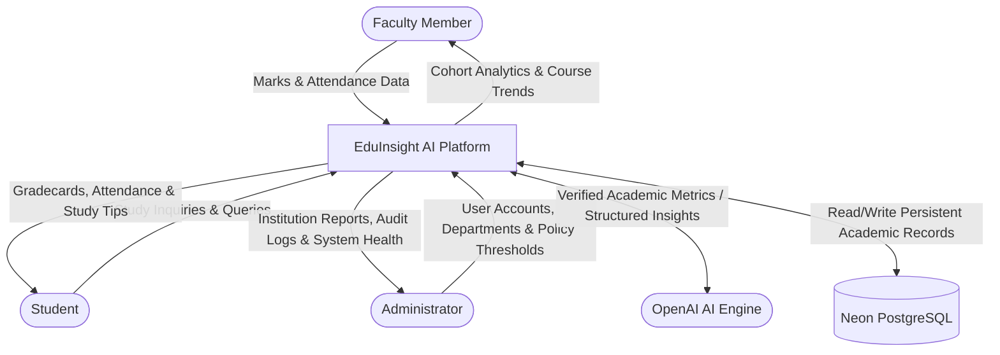
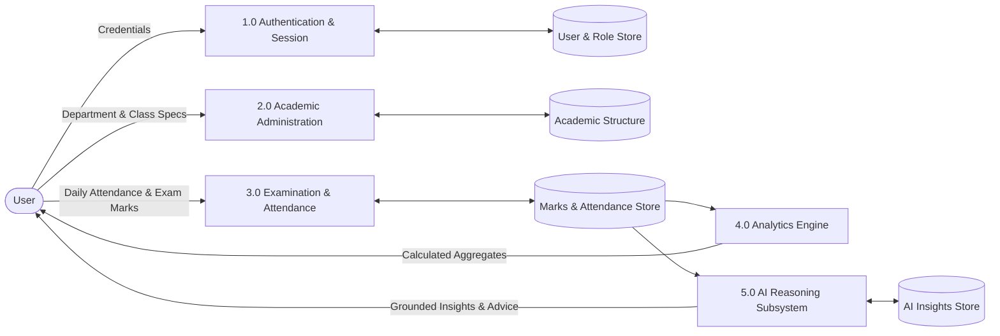

# Data Flow Diagram (DFD Level 0 & Level 1)

## DFD Level 0 (Context Diagram)

```mermaid
flowchart TD
    Faculty([Faculty Member])
    Student([Student])
    Admin([Administrator])
    AI_Service([OpenAI AI Engine])

    System[EduInsight AI Platform]
    DB[(Neon PostgreSQL)]

    Faculty -->|Marks & Attendance Data| System
    System -->|Cohort Analytics & Course Trends| Faculty

    Student -->|Study Inquiries & Queries| System
    System -->|Gradecards, Attendance & Study Tips| Student

    Admin -->|User Accounts, Departments & Policy Thresholds| System
    System -->|Institution Reports, Audit Logs & System Health| Admin

    System <-->|Verified Academic Metrics / Structured Insights| AI_Service
    System <-->|Read/Write Persistent Academic Records| DB
```

## DFD Level 1 (Decomposition)

```mermaid
flowchart LR
    User([User])
    P1[1.0 Authentication & Session]
    P2[2.0 Academic Administration]
    P3[3.0 Examination & Attendance]
    P4[4.0 Analytics Engine]
    P5[5.0 AI Reasoning Subsystem]

    DB1[(User & Role Store)]
    DB2[(Academic Structure)]
    DB3[(Marks & Attendance Store)]
    DB4[(AI Insights Store)]

    User -->|Credentials| P1
    P1 <--> DB1

    User -->|Department & Class Specs| P2
    P2 <--> DB2

    User -->|Daily Attendance & Exam Marks| P3
    P3 <--> DB3

    DB3 --> P4
    P4 -->|Calculated Aggregates| User

    DB3 --> P5
    P5 <--> DB4
    P5 -->|Grounded Insights & Advice| User
```

