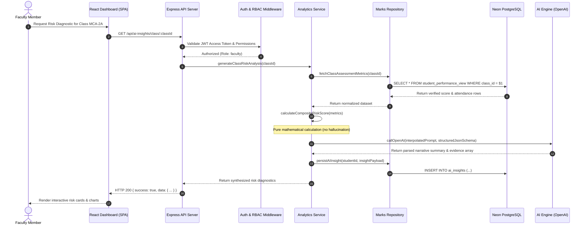

# Sequence Diagram - AI Academic Insight Generation

```mermaid
sequenceDiagram
    autonumber
    actor Faculty as Faculty Member
    participant Client as React Dashboard (SPA)
    participant API as Express API Server
    participant Auth as Auth & RBAC Middleware
    participant Service as Analytics Service
    participant Repo as Marks Repository
    participant DB as Neon PostgreSQL
    participant AI as AI Engine (OpenAI)

    Faculty ->> Client: Request Risk Diagnostic for Class MCA-2A
    Client ->> API: GET /api/ai-insights/class/:classId
    API ->> Auth: Validate JWT Access Token & Permissions
    Auth -->> API: Authorized (Role: faculty)

    API ->> Service: generateClassRiskAnalysis(classId)
    Service ->> Repo: fetchClassAssessmentMetrics(classId)
    Repo ->> DB: SELECT * FROM student_performance_view WHERE class_id = $1
    DB -->> Repo: Return verified score & attendance rows
    Repo -->> Service: Return normalized dataset

    Service ->> Service: calculateCompositeRiskScore(metrics)
    Note over Service: Pure mathematical calculation (no hallucination)

    Service ->> AI: callOpenAI(interpolatedPrompt, structuredJsonSchema)
    AI -->> Service: Return parsed narrative summary & evidence array
    Service ->> Repo: persistAIInsight(studentId, insightPayload)
    Repo ->> DB: INSERT INTO ai_insights (...)

    Service -->> API: Return synthesized risk diagnostics
    API -->> Client: HTTP 200 { success: true, data: { ... } }
    Client -->> Faculty: Render interactive risk cards & charts
```

