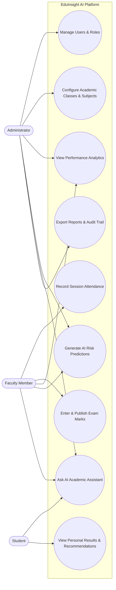

# Use Case Diagram

```mermaid
flowchart LR
    Admin([Administrator])
    Faculty([Faculty Member])
    Student([Student])

    subgraph System["EduInsight AI Platform"]
        UC1((Manage Users & Roles))
        UC2((Configure Academic Classes & Subjects))
        UC3((Record Session Attendance))
        UC4((Enter & Publish Exam Marks))
        UC5((View Performance Analytics))
        UC6((Generate AI Risk Predictions))
        UC7((Ask AI Academic Assistant))
        UC8((View Personal Results & Recommendations))
        UC9((Export Reports & Audit Trail))
    end

    Admin --> UC1
    Admin --> UC2
    Admin --> UC5
    Admin --> UC6
    Admin --> UC7
    Admin --> UC9

    Faculty --> UC3
    Faculty --> UC4
    Faculty --> UC5
    Faculty --> UC6
    Faculty --> UC7

    Student --> UC7
    Student --> UC8
```
